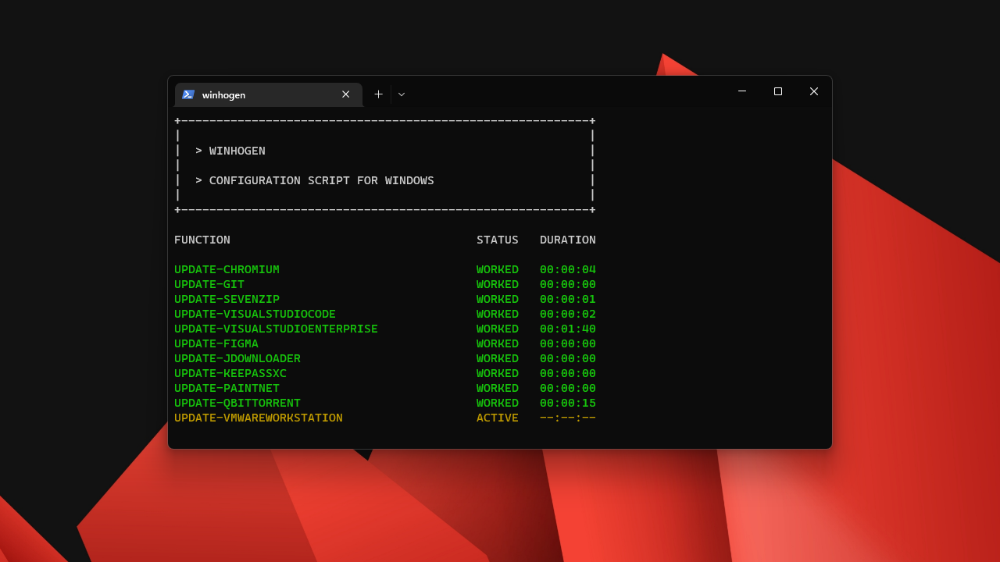

# <samp>OVERVIEW</samp>

Opinionated post-installation script for Windows 11.



# <samp>GUIDANCE</samp>

## Gather and launch the latest version

Running this blindly is strongly discouraged.

```powershell
$address = "https://raw.githubusercontent.com/sharpordie/winhogen/main/src/winhogen.ps1"
$fetched = ni $env:temp\winhogen.ps1 -f ; iwr $address -o $fetched
try { pwsh -ep bypass $env:temp\winhogen.ps1 } catch { powershell -ep bypass $env:temp\winhogen.ps1 }
```